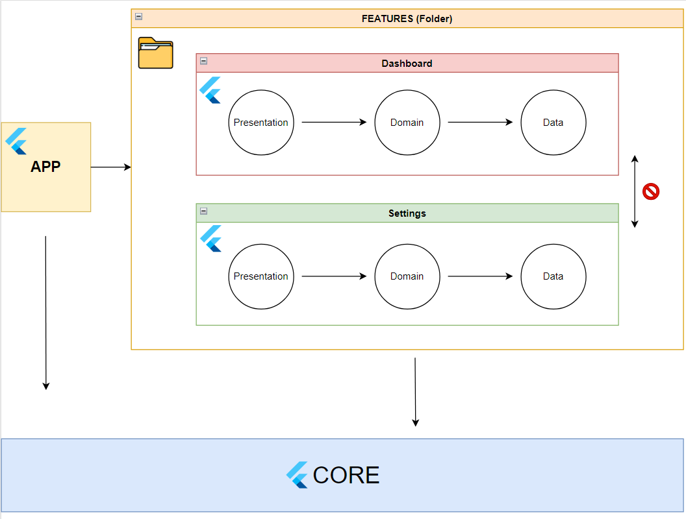

# Flutter Modular Clean Architecture

This is an example base project for Flutter developers who would like to use multiple packages/modules with clean architecture in their project.

  

#### The app has the following features:

* Dashboard
  * Main Screen
    * Navigating to Number Screen
    * Navigating to Stream Screen
    * Navigation to Settings Screen
  * Number Screen
    * Fetching a random number between 0 and maximum limit of the user's choice
    * Navigation to Settings Screen
  * Stream Screen
    * Fetching a random number between 0 and maximum limit of the user's choise every second
    * Navigation to Settings Screen
* Settings
  * Settings Screen
    * Changing the theme
    * Changing the language

#### Used libraries:
  * logger: https://pub.dev/packages/logger
  * equatable: https://pub.dev/packages/equatable
  * flutter_bloc: https://pub.dev/packages/flutter_bloc
  * bloc_concurrency: https://pub.dev/packages/bloc_concurrency
  * collection: https://api.dart.dev/stable/3.1.5/dart-collection/dart-collection-library.html
  * kiwi: https://pub.dev/packages/kiwi
  * intl: https://pub.dev/packages/intl

